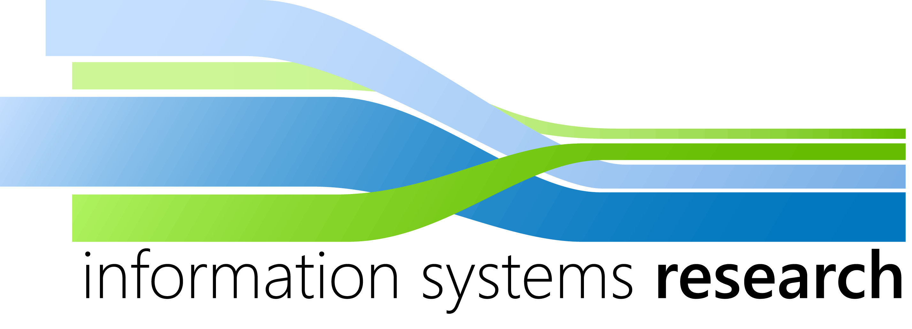

# Python Web-Scraping Workshop

## About this course
In this course you will learn the basics of Python programming as well as the details on how to program a web-scraper. A web-scraper is a small program that automatically opens websites and searches for specified data. This course is splitted into three main parts:
- Introduction to Python Programming
- Introduction to Web-Scraping with Python
- Exercises
- Solutions to the Exercises
- The complete web scraper

## About the Instructor
<table class="table6">
<tbody>
<tr>
<td>

&nbsp;

</td>
<td>

</td>
<td>
<table class="table7">
<tbody>
<tr>
<td>Phone:</td>
<td>+49 761 203-XXXX&nbsp;</td>
</tr>
<tr>
<td>Fax:</td>
<td>+49 761 203-XXXX&nbsp;</td>
</tr>
<tr>
<td>E-Mail:</td>
<td>markus.rosenfelder at is.uni-freiburg.de</td>
</tr>
</tbody>
</table>
</td>
</tr>
<tr>
<td colspan="2"><strong>Office hours</strong></td>
<td></td>
</tr>
<tr>
<td></td>
<td>On appointment</td>
<td></td>
</tr>
<tr>
<td colspan="2"><strong>Activities</strong></td>
<td></td>
</tr>
<tr>
<td></td>
<td></td>
<td></td>
</tr>
<tr>
<td></td>
<td></td>
<td>IT Technician for the Faculty of Economic Sciences</td>
</tr>
<tr>
<td></td>
<td></td>
<td></td>
</tr>
<tr>
<td colspan="2"><strong>Teaching</strong></td>
<td></td>
<td></td>
</tr>
<tr>
<td style="text-align: justify; "></td>
<td></td>
<td></td>
</tr>
<tr>
<td style="text-align: justify; "></td>
<td>WS 2018/19</td>
<td>

Exercise: Wirtschaftsinformatik für die Unternehmensführung: “Optimization and Simulation” Seminar: Data Analytics in R and Python

</td>
</tr>
<tr>
<td style="text-align: justify; "></td>
<td>SS 2018</td>
<td>

Exercise: Business Intelligence Seminar: Business Intelligence in R and Python

</td>
</tr>
<tr>
<td style="text-align: justify; "></td>
<td></td>
<td></td>
</tr>
<tr>
<td colspan="2"><strong>Education</strong></td>
<td>&nbsp;</td>
</tr>
<tr>
<td>&nbsp;</td>
<td>&nbsp;</td>
<td>&nbsp;</td>
</tr>
<tr>
<td></td>
<td>10/2015&nbsp;- 05/2018</td>
<td>

Master of Science in Volkswirtschaftslehre, Albert-Ludwigs-Universität Freiburg Thesis: „Rising High: Improving Real Estate Valuation with 3D City Models and Spatial Analytics“

</td>
</tr>
<tr>
<td>&nbsp;</td>
<td>10/2012 - 10/2015</td>
<td style="text-align: justify; ">

Bachelor of Science in Volkswirtschaftslehre, Albert-Ludwigs Universität Freiburg Thesis: „Geo-spatial analysis of different car types in free-floating carsharing | Betreuer: Prof. Dr. Neumann

</td>
</tr>
<tr>
<td>&nbsp;</td>
<td>&nbsp;</td>
<td>&nbsp;</td>
</tr>
<tr>
<td colspan="3"><strong>Additional Activities</strong></td>
</tr>
<tr>
<td>&nbsp;</td>
<td>&nbsp;</td>
<td>&nbsp;</td>
</tr>
<tr>
<td></td>
<td>

10/2017 – 02/2018

</td>
<td style="text-align: justify; ">

Student assistant at the chair of Information Systems, Albert-Ludwigs-Universität Tutor for„Management of Information Systems: Einführung in die Wirtschaftsinformatik“

</td>
</tr>
<tr>
<td></td>
<td>

10/2016 – 12/2017

</td>
<td>

Working student at Geospin GmbH Programming in the field of geographical data science&nbsp;

</td>
</tr>
<tr>
<td>&nbsp;</td>
<td>02/2013 – 12/2017</td>
<td>

Student assistant at the chair of Information Systems, Albert-Ludwigs-Universität  IT and system administration

</td>
</tr>
<tr>
<td style="text-align: justify; ">&nbsp;</td>
<td>&nbsp;</td>
<td>&nbsp;</td>
</tr>
<tr>
<td colspan="2"><strong>Supervised Theses</strong></td>
<td></td>
</tr>
<tr>
<td style="text-align: justify; ">&nbsp;</td>
<td colspan="2">
<ul>
<li>Creating knowledge by mining multi-source big data in transport.&nbsp;Case study in Thessaloniki&nbsp;</li>
<li>Creating an Edge: Predicting Stock Prices with Sentiment Analysis</li>
<li>Maschinelles Lernen: Probabilistische Methoden in der wirtschaftlichen Anwendung</li>
<li>Applied Machine Learning in Economics: Predicting Real Estate Prices in Munich</li>
<li>Spatio-temporal Modeling: Analyzing Street Crime in Detroit</li>
<li>Failed Cities: Spatial Analysis of Street Crime in Detroit</li>
<li>Data Mining: Hyperparameter Optimization for Real Estate Prediction Models</li>
</ul>
</td>
</tr>
</tbody>
</table>

## From 0 to Data Scientist with Python - Reading and Watching List

This list should be followed step by step. There are a few overlaps between the resources, but overall the next step most often requires knowledge of the previous step.

## If you do not have any prior programming experience

0. [Automate the boring stuff with python](https://automatetheboringstuff.com/)

## If you have prior programming experience

1. [The Quick Python Book](https://www.manning.com/books/the-quick-python-book-third-edition)

2. [Intro to Numerical Computing with NumPy (Beginner)](https://www.youtube.com/watch?v=V0D2mhVt7NE)
  
3. [Pandas for Data Analysis](https://www.youtube.com/watch?v=oGzU688xCUs)

4. [Web Scraping with BeautifulSoup and Requests](https://www.youtube.com/watch?v=ng2o98k983k)

5. [Data Visualization and Exploration with Python](https://www.youtube.com/watch?v=KvZ2KSxlWBY)

6. [The Hundred-Page Machine Learning Book](https://www.amazon.de/dp/199957950X)

7. [Hands-On Machine Learning with Scikit-Learn and TensorFlow](http://shop.oreilly.com/product/0636920052289.do) - Read until "Part II. Neural Networks and Deep Learning"

8. [Deep Learning with Python, TensorFlow, and Keras tutorial - Playlist](https://www.youtube.com/watch?v=wQ8BIBpya2k&list=PLQVvvaa0QuDfhTox0AjmQ6tvTgMBZBEXN)

9.1. [But what is a Deep Neural Network? Part 1](https://www.youtube.com/watch?v=aircAruvnKk)

9.2. [But what is a Deep Neural Network? Part 2](https://www.youtube.com/watch?v=IHZwWFHWa-w)

10. [Deep Learning with Python](https://www.manning.com/books/deep-learning-with-python)

11. [Hands-On Machine Learning with Scikit-Learn and TensorFlow](http://shop.oreilly.com/product/0636920052289.do) - Read from "Part II. Neural Networks and Deep Learning"
  
### Additional suggested material

* [Python Data Science Handbook](https://jakevdp.github.io/PythonDataScienceHandbook/)

* [Jupyterlab as a development environment - Getting Started with JupyterLab (Beginner Level)](https://www.youtube.com/watch?v=Gzun8PpyBCo)

* [Docker for Data Scientists](https://towardsdatascience.com/docker-for-data-scientists-5732501f0ba4)

* [Stanford Lecture Collection | Convolutional Neural Networks for Visual Recognition (Spring 2017)](https://www.youtube.com/watch?v=vT1JzLTH4G4&list=PL3FW7Lu3i5JvHM8ljYj-zLfQRF3EO8sYv)

* [Statistical modelling with python (statsmodels)](https://www.youtube.com/watch?v=V86gTgL1FRw)
